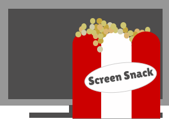

# Screen Snack
Screen Snack is a web application that allows users to explore and manage a personalized watchlist of movies and series. With an intuitive interface and rich feature set, users can easily browse titles, add them to their watchlist, and track their viewing progress.

## Technologies Used

- **Frontend**: Vue.js with Inertia.js.
- **Frontend packages:**
  - **Headless UI** for building accessible and reusable components.
  - **Heroicons** for icons.
  - **Vue3 lazy load** for lazy loading images.
- **Backend**: Laravel.
- **Backend packages:**
  - **Salon** for API resource management.
- **Database**: MySQL.
- **Authentication**: Laravel Sanctum.
- **Styling**: Tailwind CSS.

## Getting Started

These instructions will get you a copy of the project up and running on your local machine for development and testing purposes.

## Quick Start
### Prerequisites
- Node version v20.12.2 and yarn
- Installed and working Docker set-up with traefik

### Quick installation
- Clone the project.
- create the docker container.
- Setup enviroment variables.
- Run yarn for the frontend.

For more detailed instructions, see the [Installation Guide](documentation/Installation.md).

## Quick Links
- [Installation Guide](documentation/Installation.md)
- [Features](documentation/Features.md)

## License
Distributed under the MIT License. See LICENSE for more information.

